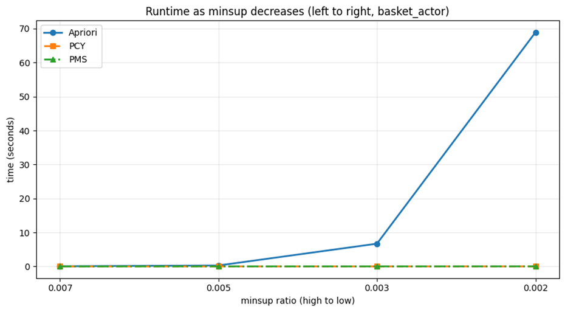
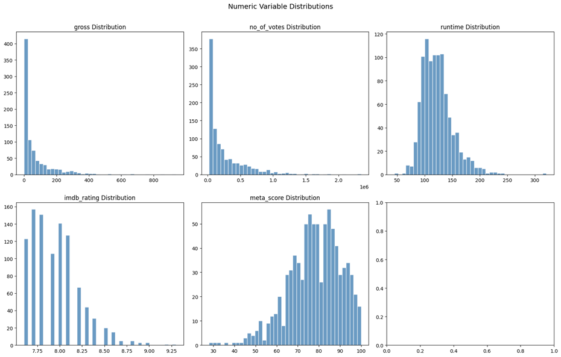

# IMDB Top 1000 – What makes a movie successful?

Each film is a shopping basket of cast members and success tiers. Mining them with Apriori, PCY and PCY-Multistage finds the actor pairings and attribute combinations that keep showing up in films people love — and shows when hashing beats brute force by three orders of magnitude.



[Full report (PDF)](report.pdf) · [Notebook](code/experiment-code-v4.0.ipynb) · [LaTeX source](report_latex/)

## Context

Association-rule mining is the "customers who bought X also bought Y" technique. Here the transactions are the 1,000 films in the IMDB Top-1000 list, and the items are the four lead actors of each film plus discretised success attributes (gross, rating, votes, runtime, metascore tiers). Two questions:

1. **Algorithms** — how do Apriori, PCY (Park-Chen-Yu) and PCY-Multistage (PMS) behave on a real transactional dataset as the support threshold falls? All three are implemented from scratch.
2. **Rules** — after significance and redundancy filtering, which actor collaborations and actor/attribute → success-tier rules actually survive?

## Data

`code/data/imdb_top_1000.csv` — 1,000 films, 16 columns (title, year, certificate, runtime, genre, IMDB rating, metascore, director, four stars, votes, gross). Two basket designs:

| Basket | Items per basket | Distinct items |
|---|---|---|
| Actor-only | 4 lead actors | ~2,700 actors |
| Enriched | 4 actors + 5 tier features (gross / rating / votes / runtime / metascore) | actors + 15 tier tokens |

## Results

**Algorithms**

- **PCY and PMS find exactly the same frequent itemsets as Apriori** (L1 = 641, L2 = 121 at minsup = 2) while counting far fewer candidate pairs.
- **At low support the difference is three orders of magnitude:** on actor-only baskets at minsup = 2, Apriori takes ≈ 65 s, PCY ≈ 0.013 s, PMS ≈ 0.014 s. At higher support all three converge and hashing overhead can even make PCY/PMS marginally slower — exactly what the theory predicts.
- **On enriched baskets PMS prunes hardest:** at minsup = 5 it cuts C2 candidates from 1,230 (Apriori) to 547 (−55.5%); at minsup = 10 from 243 to 141 (−42%).

**Rules** (enriched baskets, PMS, minconf 0.5, Fisher p < 0.05, redundancy + maximality pruning; 475 raw rules → 160 final at minsup 10, 46 → fewer at minsup 50)

- `{Tom Hanks} → gross_tier:high` — 14 of 14 films, lift 3.6. `{Leonardo DiCaprio, votes:high} → gross:high` and `{Matt Damon, votes:high} → gross:high` — 10 of 10 each.
- `{gross:high, rating:high} → votes:high` — confidence 0.98, lift 2.9, support 84 films: the well-reviewed hits are also the most-voted.
- `{runtime:high, votes:high} → gross:high` — confidence 0.76 on 100 films: long, widely-seen films earn.
- Actor-only baskets (PCY, minsup 5) surface high-lift actor–actor links that match known collaborations; stricter filtering removes nearly all weak or duplicated rules.

## Approach

- **Apriori, PCY, PMS implemented by hand** (no `mlxtend` for the mining step) so candidate counts, bucket occupancy and pass counts can be instrumented; 2,048 / 4,096 hash buckets.
- Minsup grid 0.002–0.05 of baskets; runtime measured per pass.
- Rule metrics: support, confidence, lift, interest (leverage), Kulczynski, Fisher's exact test. Filtering: significance → redundancy → maximality.
- Discretisation of gross / rating / votes / runtime / metascore into low / mid / high tiers (with explicit `unknown` tier for missing gross and metascore).



## Stack

Python · pandas · NumPy · SciPy (Fisher test) · matplotlib · Jupyter · LaTeX

## Run it

```bash
python -m venv .venv
.venv\Scripts\Activate.ps1        # Windows   |   source .venv/bin/activate   # macOS/Linux
pip install -r requirements.txt
cd code && jupyter lab            # open experiment-code-v4.0.ipynb, Run All
```

Rebuild the report: `cd report_latex && .\compile_pdf.ps1` (falls back to `pdflatex + biber` if `latexmk` is missing).

Fix the random seed and bucket count at the top of the notebook to reproduce the tables exactly; runtimes are machine-dependent.

## Structure

```
market-basket-analysis-apriori-pcy-pms/
├── code/
│   ├── experiment-code-v4.0.ipynb        # data prep, three algorithms, benchmarks, rule mining
│   ├── data/imdb_top_1000.csv
│   └── report_exports/section_6/tables/  # final rule tables (.pkl)
├── report.pdf
├── report_latex/                          # main.tex, .bib, figures/, compile_pdf.ps1
├── assets/                                # README figures
└── requirements.txt
```

Course project for *Algorithms for Massive Datasets*.
